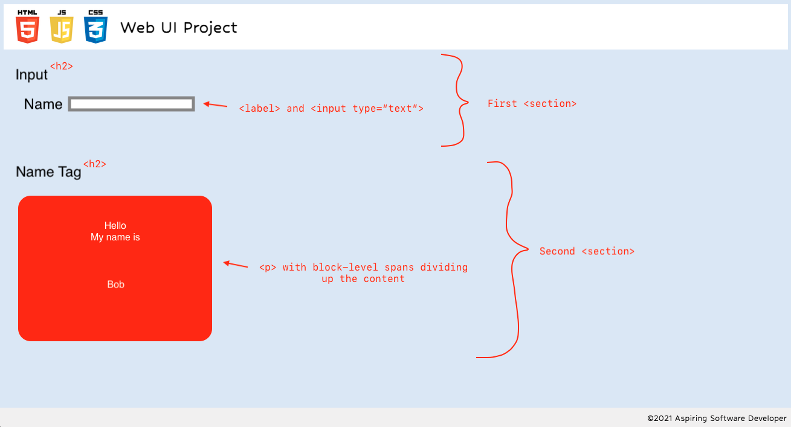

# Name Tags

## Planning

### HTML Outline

The app needs two sections: one for the inputs and another for the name tag display. The inputs section should contain a text input box with an associated label. The name tag itself can be a paragraph element with its inner content divided into spans and styled.

### State

- The app has two pieces of state: the content in the input and the content in the name display.
- The above two pieces of state should sync whenever the input content changes.

### Events

We will use the `input` event to detect when the name input element changes.

---

## The prompt

### The Golden Rule

🦸 🦸‍♂️ `Stop starting and start finishing.` 🏁

1. Limit Work in Progress (WIP)
1. Validate each line of code before moving forward
1. Keep it Simple Simon (KISS)

### Making a plan

1. Make a drawing of your app. **Simple "wireframes"**
1. Once you have a drawing, **name the HTML elements** you'll need to realize your vision**
1. For each HTML element ask: **Why do I need this?**
    - Does this element need **static content**, or is the content **dynamic state**?
    - If **state** where is the source of truth?
1. **Find all the 'events'** (user clicks, form submit, on load etc) in your app. Ask one by one, "What happens when" for each of these events. Does any state change?
1. Once we know the _why_ of elements, state, and events -- think about how to implement the "Why" as a "How"
1. Think about how to **validate each of your features** according to a Definition of Done
1. Consider what features **_depend_ on what other features**. Use this dependency logic to figure out what order to complete tasks.
